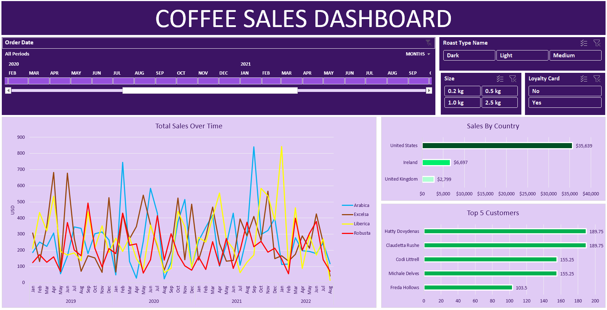

📊 Project Overview
-------------------

This project involved building an interactive **Coffee Sales Dashboard** using Excel. The dashboard allows users to explore sales data by various dimensions, such as order date, roast type, size, and loyalty card usage, among others. The purpose of this project was to create a dynamic tool that visually represents the sales data, enabling easier analysis and decision-making.

###🔧 Key Concepts Explained
-------------------------

### 1\. **IF Statements**

The `IF` function is a logical function in Excel that returns one value if a condition is true and another value if it's false. In the provided formula:

*   **Purpose:** This formula is used to map short codes (like "Rob", "Exc", "Ara", "Lib") in column `I` to their full names ("Robusta", "Excelsa", "Arabica", "Liberica") in column `N`.
*   **How It Works:** The formula checks the value in cell `I2` and returns the corresponding full name. If `I2` is "Rob", the formula returns "Robusta". If none of the conditions are met, it returns an empty string.
*   ### 2\. **INDEX MATCH**
    
    `INDEX MATCH` is a powerful combination of functions in Excel used for advanced lookups. The formula shown in the image is:
    
      
    
    *   **Purpose:** This formula looks up and returns a value from the `products` table based on specific criteria from the `orders` table.
    *   **How It Works:**
        *   **`MATCH(orders!$D2,products!$A$1:$A$49,0)`**: Finds the row in `products` where the value in `orders!$D2` matches a value in column `A` of the `products` table.
        *   **`MATCH(orders!I$1,products!$A$1:$G$1,0)`**: Finds the column in `products` where the value in `orders!I$1` matches a value in row `1` of the `products` table.
        *   **`INDEX(products!$A$1:$G$49, row_num, col_num)`**: Returns the value from the intersection of the found row and column in the `products` table.  
    
    ### 3\. **XLOOKUP**
    
    `XLOOKUP` is a more modern and versatile lookup function in Excel. It replaces older functions like `VLOOKUP` and `HLOOKUP`, offering more flexibility. The formula in the image is:

    
    
    *   **Purpose:** This formula is used to look up a value in the `customers` table based on a key in column `C` and return the corresponding value from another column.
    *   **How It Works:**
        *   **`XLOOKUP(C2,customers!$A$1:$A$1001,customers!$G$1:$G$1001,,0)`**:
            *   `C2`: The value to look up.
            *   `customers!$A$1:$A$1001`: The range to search for the value.
            *   `customers!$G$1:$G$1001`: The range from which to return the corresponding value.
            *   The `0` at the end specifies an exact match. If no match is found, it returns an error.
*   **Data Analysis:**
    *   **Pivot Tables:** Created to summarize and analyze data.
    *   **Pivot Charts:** Visualized data through various chart types, such as bar charts and line charts.
*   **Dashboard Creation:**
    *   **Slicers and Timelines:** Added for interactivity, allowing users to filter data by specific dimensions and time periods.
    *   **Formatting:** Applied consistent formatting to enhance readability and visual appeal.
 

### 🔑 Key Steps

#### 1\. Data Preparation

*   Data was cleaned and formatted to ensure consistency.
*   Checked for and removed duplicates.
*   Converted data ranges into tables for easier management.

#### 2\. Formulas and Functions

*   **XLOOKUP** and **INDEX MATCH** were used for data retrieval across different sheets.
*   Created calculated columns, such as total sales, using multiplication formulas.
*   Applied **IF statements** for categorizing roast types and other attributes.

#### 3\. Pivot Tables and Pivot Charts

*   Built pivot tables to summarize sales data by various dimensions.
*   Created pivot charts to visualize key metrics like sales by country and top customers.

#### 4\. Dashboard Creation

*   Combined pivot tables, pivot charts, slicers, and timelines into an interactive dashboard.
*   Added visual elements, such as color-coded charts, to enhance data interpretation.

#### 5\. Formatting and Final Touches

*   Applied consistent formatting across tables and charts.

### 🎯 Conclusion

The final product is a comprehensive Coffee Sales Dashboard that provides valuable insights into sales performance across various dimensions. 

🎉 Shoutout
-----------

A special shoutout to **Mo Chen** from YouTube for the inspiration and guidance in creating this practical Coffee Sales Dashboard. Your tutorials and insights were invaluable in bringing this project to life. Thank you for sharing your knowledge and helping others learn through your content!
